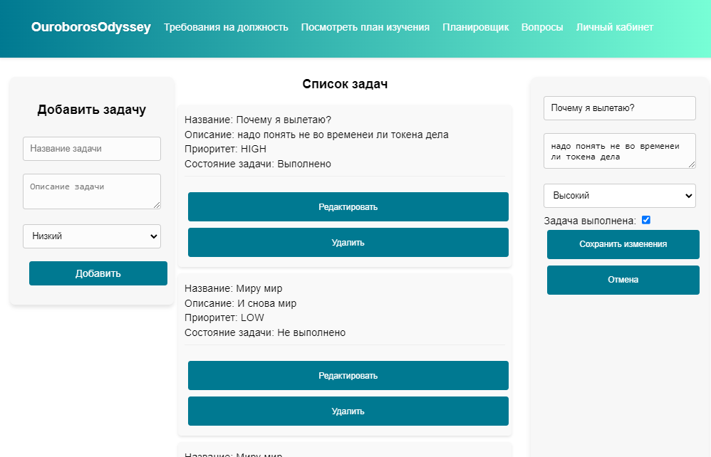
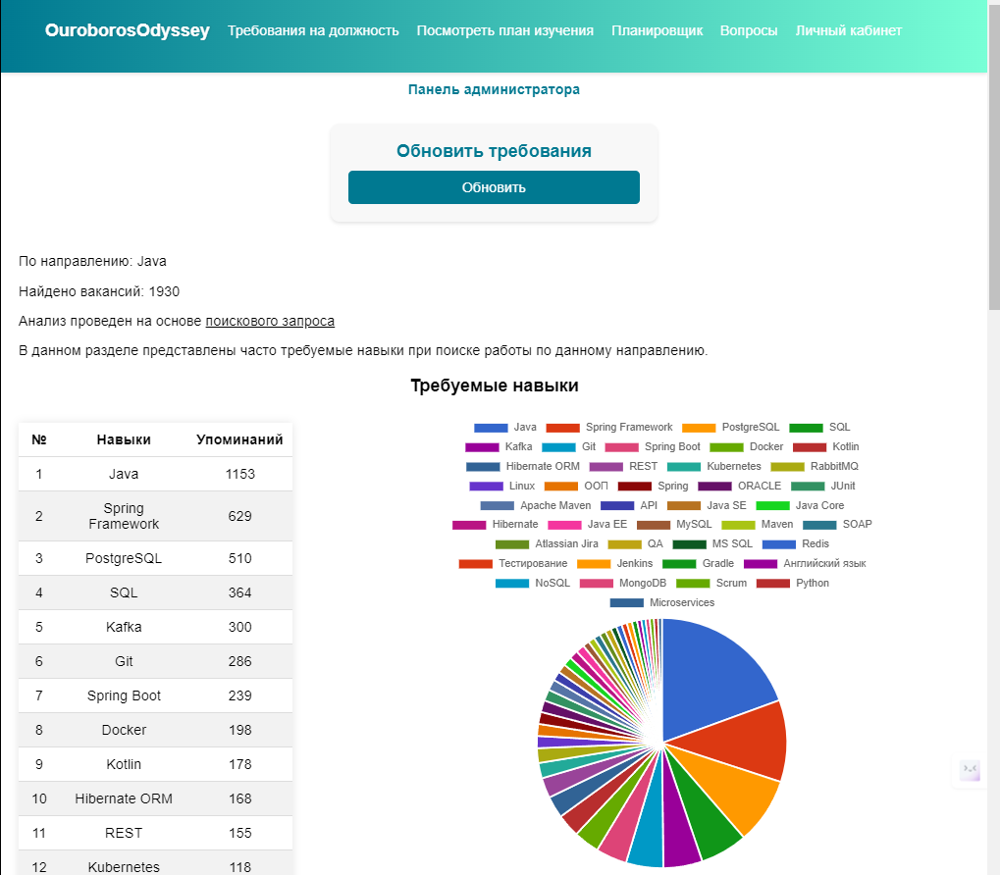
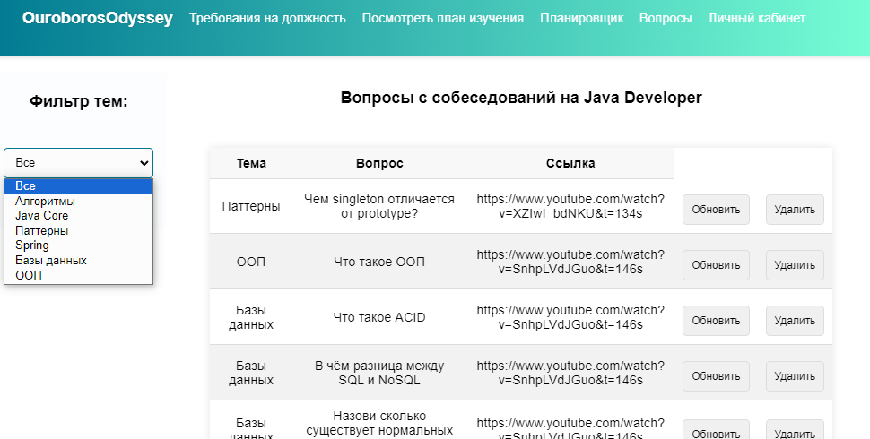
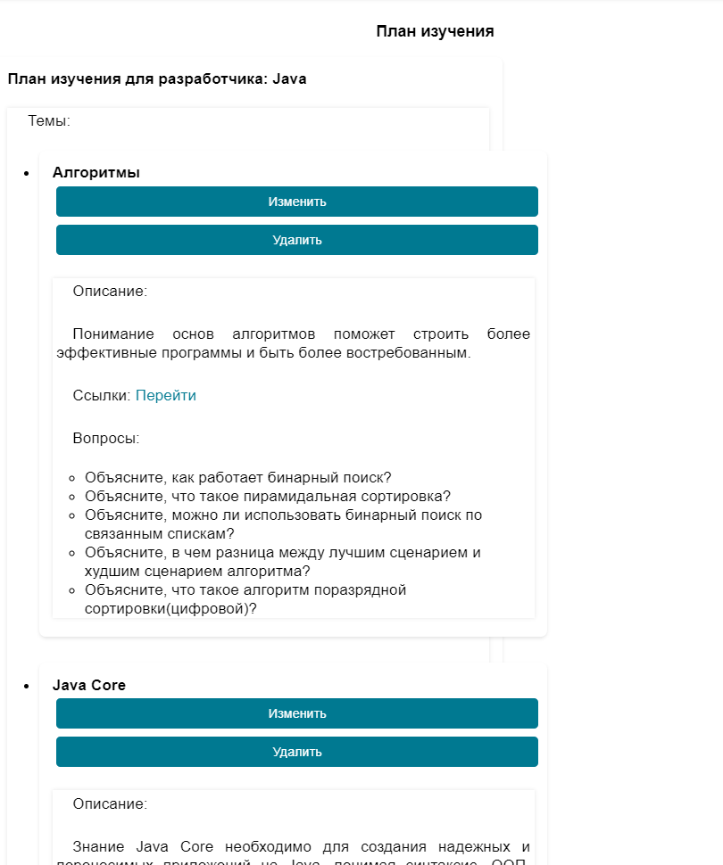

## Task Scheduler and vacancy analysis
Spring Boot приложение для изучение java-направления 
и планирование своих целей.

Поданному URL адреса после запуска можно посмотреть документацию swagger:

http://localhost:8081/swagger-ui/index.html

## Функционал приложения:

* Статистика по навыкам на вакансии по направлению java.
* Планировщик задач.
* Список вопросов.
* План изучения.

Предоставление доступа к функционалу планировщика реализовано 
с помощью JWT-аутентификации.

#### Работа с пользователями:

- Регистрация
- Авторизация

#### Работа с задачами (доступно только авторизованым пользователям):

- Создание
- Чтение
- Редактирование(Изменение заголовка, описания, приоритет задачи, пометка о выполнении задачи)
- Удаление

#### Взаимодействие с требованиями на должность:
- Просмотр требований по навыкам.
- Обновление требований( Извлечение навыков из вакансий на HH).

#### Списки вопросов:
- Просмотр всех вопросов по темам или по определенной теме.
- Обновить.
- Удалить.

#### План изучения:
- Просмотр всех тем.
- Обновить тему.
- Удалить тему.

### Стэк технологий:
* Java
* Spring Boot
* Hibernate
* Spring Security
* Springdoc/OpenApi
* JUnit 5
* Lombok
* JWT - token
* Postgresql
* Maven
* Docker
* MVC - архитектурный паттерн

####  За фронт отвечают:
* Thymeleaf
* JS,HTML,CSS
